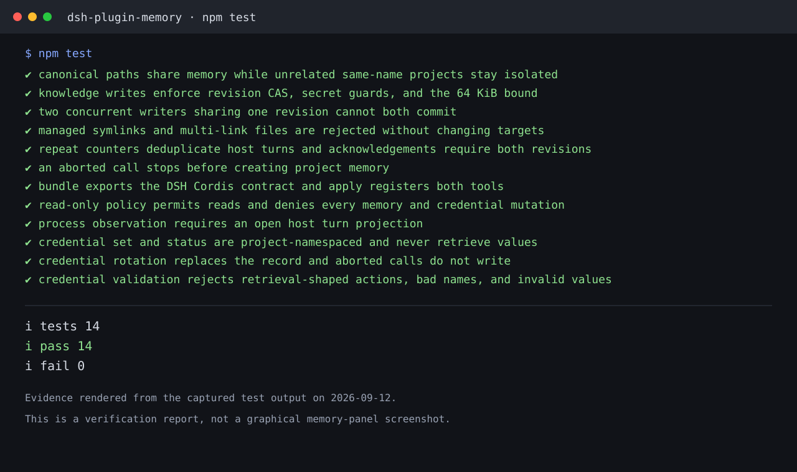

# DSH Memory Plugin

`dsh-plugin-memory` provides project-scoped durable knowledge and write-only,
non-retrievable credential status tools for DeepSeek Harness. It is an ESM
Cordis plugin targeting Harness `0.1.5-rc.2`.

## Verification screenshot



Figure: functional verification evidence rendered from the real `npm test`
output (14 passed, 0 failed), rather than a graphical memory-panel capture.
See [`docs/screenshots/SOURCES.md`](docs/screenshots/SOURCES.md) for provenance
and validation boundaries.

## Install

Use the same `DSH_HOME` for installation and every Harness launch:

```sh
export DSH_HOME=/absolute/path/to/your/dsh-home
git clone https://github.com/hzxwonder-dsh-plugins/dsh-plugin-memory.git
cd dsh-plugin-memory
npm ci
dsh plugin --profile migration add "file:$PWD"
dsh --profile migration
```

Keep the `file:` prefix; a bare path is treated as `link:` by pnpm and does not
resolve the plugin's declared dependencies.

Replace `migration` in both commands for another profile. The host profile
must provide `tools`, `credentials`, `sessionProjections`, and
`sandboxPolicy`. The bundle patch inserts the stable
`dsh-plugin-memory` entry and does not modify Harness source.

## Current verification status

Local checks currently report:

| Check | Result | Evidence |
| --- | --- | --- |
| Unit and integration tests | Pass (14/14) | `npm test` |
| JavaScript syntax | Pass | `node --check index.js && node --check store.js` |
| Package contents | Pass | `npm run pack:check` |
| migration profile loading | Confirmed | `dsh --profile migration --dump-config` |
| Harness Web startup | Pass | Disposable profile starts and loads the plugins |
| Real Harness Agent | Pass | Tool registration, memory read/write/CAS rejection, credential write and status-only results; deployment `tests/harness-integration.mjs` |

Storage, concurrency, policy, and credential boundaries are covered by automated checks and a real Harness Agent fixture. The fixture uses synthetic data and invokes the official tool registry without an external model request.

## The `memory` tool

Storage identity comes from `exec.agent.session.header.cwd`; the model cannot
choose a project path in tool arguments:

1. Resolve the path to a canonical real directory.
2. Hash that path with SHA-256 to obtain the project ID.
3. Store knowledge and process state below
   `$DSH_HOME/plugin-data/memory/<project-id>/`.

Aliases of one checkout share memory, while unrelated same-name directories
remain isolated. Actions:

- `read`: return the complete Markdown document, its revision, and pending
  maintenance processes.
- `write`: replace the complete document when `baseRevision` still matches.
- `forget`: replace the document under the same revision check to remove
  obsolete facts.
- `observe_process`: record a process only after it and its final checks
  genuinely complete.

A process is counted once per host turn. Two distinct turns observing the same
process create a pending maintenance item. Acknowledgement must include the
latest knowledge revision, maintenance revision, and the exact updated process
IDs together with the complete new document.

## The `memory_credentials` tool

The tool accepts environment-style names and exposes two actions:

- `secret_set`: write or rotate a credential for the current project and
  return only its name and saved status.
- `secret_status`: report whether a named credential is configured.

Records are stored through Harness `ctx.credentials`, with an ID containing
both the project ID and a name digest. The plugin exposes no read, export,
environment-injection, command, or network action for credential values, and
tool results never return the value.

### Session-record boundary

Harness records complete tool arguments before execution. A value supplied to
`secret_set` can therefore appear in Session history and reach the configured
model provider. The plugin cannot alter that history. Use `secret_set` only
when this exposure is acceptable; record variable names, never values, in
ordinary knowledge.

## Sandbox policy

The plugin resolves the current Session's `sandboxPolicy` before every call:

- `read-only` permits `memory.read` and `secret_status`.
- `write`, `forget`, `observe_process`, and `secret_set` return
  `MEMORY_SANDBOX_DENIED` before plugin-owned state changes.
- The first `memory.read` lazily creates owner-only directories and the
  initial `memory.md` under `$DSH_HOME`; this does not write to the project
  workspace. `secret_status` does not initialize ordinary memory storage.

## Storage and safety

```text
$DSH_HOME/plugin-data/memory/<sha256-canonical-project-root>/
  memory.md
  processes.json
```

Directories use `0700` and files use `0600`. Knowledge and process state are
bounded to 64 KiB, and complete-document writes use a cross-process lock plus
atomic replacement. Symlinks, hard links, and unsafe managed paths are
rejected. Lock timeouts return the stable `MEMORY_BUSY` error without guessing
that a live lock is stale. Common private-key, token, password, and secret
assignment patterns are blocked; this is a heuristic guardrail, not a
complete secret scanner.

## Develop and verify

```sh
npm install --cache /private/tmp/npm-cache-dsh-migration
npm test
npm run pack:check
```

See [`docs/spec.md`](docs/spec.md) for the contract and
[`docs/e2e.md`](docs/e2e.md) for user-path scenarios. The Chinese primary
documentation is [`README.md`](README.md).

## License and provenance

LGPL-3.0-or-later. The implementation derives from PI-Desktop's `pi.memory`
behavior and adapts it to official DSH services. Attribution is recorded in
[`NOTICE`](NOTICE); dependencies retain their own licenses.
